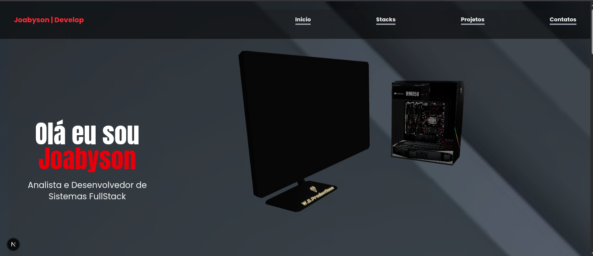
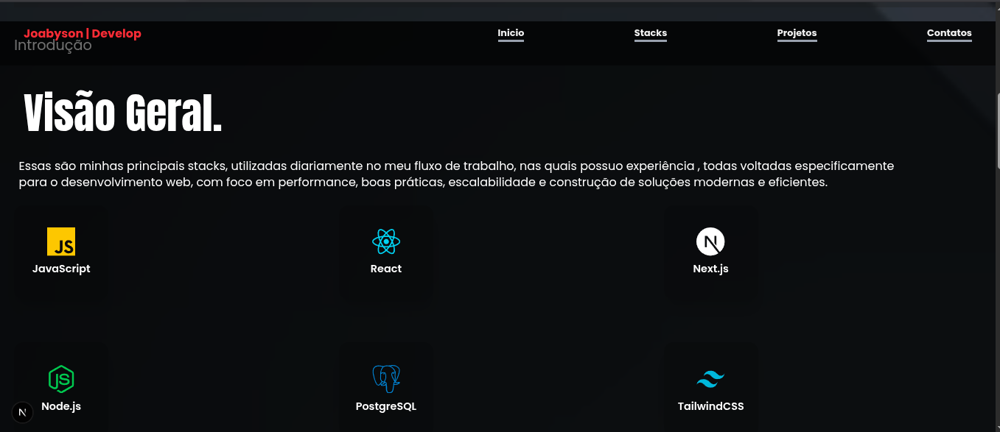
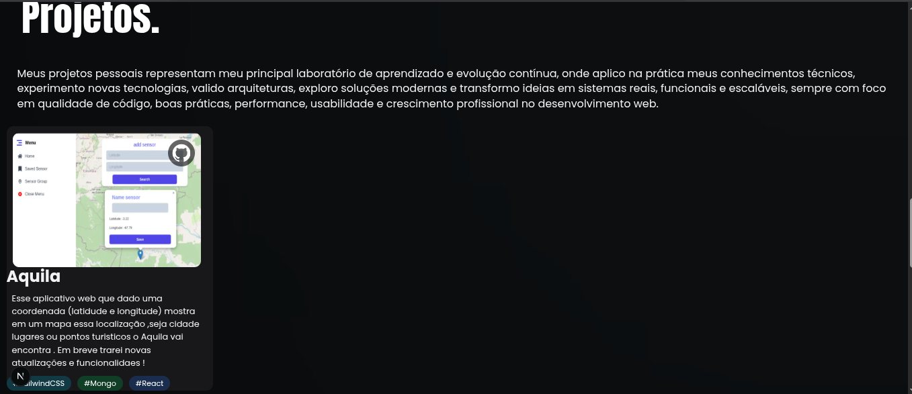
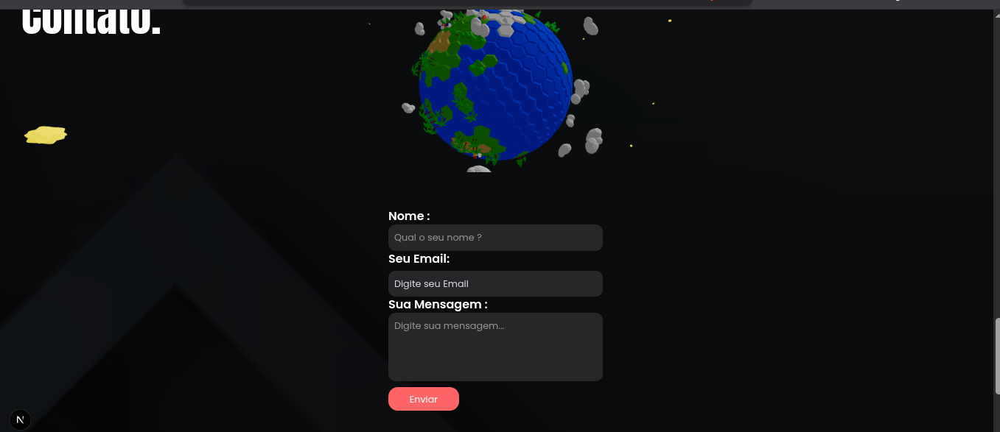

🚀 Portfólio

Um portfólio moderno desenvolvido com Next.js, React 19 e Tailwind CSS, com animações utilizando Framer Motion e integração para envio de emails utilizando Resend.

📸 Preview

🛠️ Tecnologias Utilizadas

- ⚛️ React 19  
- ▲ Next.js 15  
- 🎨 Tailwind CSS 4  
- ✨ Framer Motion  
- 📩 Resend  
- 🎯 TypeScript  
- 🎭 React Icons  
- 🧩 React Three Drei

⚙️ Instalação

Clone o repositório:

git clone https://github.com/joabysonSouza/portfolio-joabyson.git

Acesse a pasta do projeto:

cd portfolio

Instale as dependências:

npm install
▶️ Executando o Projeto
Ambiente de desenvolvimento
npm run dev

O projeto estará disponível em:

http://localhost:3000
🏗️ Build de Produção

Gerar build:

npm run build

Executar em produção:

npm start
📩 Variáveis de Ambiente

Crie um arquivo .env.local na raiz do projeto:

RESEND_API_KEY=sua_chave_aqui
✨ Funcionalidades
📱 Layout responsivo
🎞️ Animações suaves
📬 Formulário de contato
⚡ Alta performance com Next.js
🎨 Interface moderna
🌙 Fácil personalização
📦 Dependências Principais
Dependência Função
next Framework React
react Biblioteca principal
tailwindcss Estilização
framer-motion Animações
resend Envio de emails
react-icons Ícones
@react-three/drei Recursos 3D

👨‍💻 Autor

Desenvolvido por Joabyson Souza 🚀
